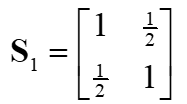
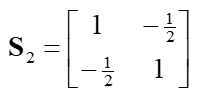
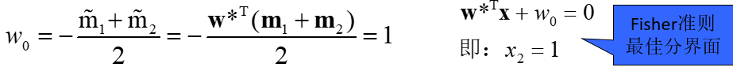

<!--more-->

## 第一章 概论

### 样本、模式、模式类的概念和关系（模式识别的系统组成）

- **模式和模式类**：在模式识别学科中，模式可以看作事对象和的组成成分或影响因素之间存在的的规律性关系，或者是因素存在确定性或随机性规律的对象、过程或事件的集合。也有人把模式称为模式类，模式识别也被称作模式分类。

- **样本**：一类事物的一个具体体现，对具体的个别事物进行观测所得到的某种形式的信号

- **样本集**：若干样本的集合。

- **样本、模式。模式类的关系**样本是具体的事物，而模式是对同一类事物概念性的概括。

  模式类与模式联合使用时，模式表示具体的事物，而模式类则是对这一类事物的概念性描述。

  模式识别是从样本到类别的映射。

- **模式分类**：根据识别对象的观测值确定其类别

- **样本与样本空间表示**：待研究对象的个体，用特征向量表示，所有可能的取值范围构成特征空间。

- **类或类别**：在所有样本上定义的一个子集，处于同一类的样本在wine吧所关心的某种性质上是不可区分的，即具有相同的模式。

- **类别与类别空间**：类别数已知，共有*c*个类别，所有类别状态构成类别空间。

- **特征**：指用于表征样本的观测，通常是数值表示的某些特征话向量特征，有时也被称作属性。

- **已知样本**：指事先知道类别标号的样本。

- **未知样本**：指类别标号未知但特征已知的样本。

### 模式识别的基本概念

- 使计算机模仿人的感知能力，从感知数据中提取信息（判别物体和行为）的过程。

### 为什么要学习模式识别和人工智能？

- **人工智能与模式识别**是研究使计算机来模拟人的某些思维过程和智能判断的学科，主要包括计算机实现智能的原理、制造类似于人脑智能的计算机，使计算机能实现更高层次的应用。
  1. **人类自身能力的延伸**：人工智能是人类自身的能力的延伸。由于自身条件的局限，人类无法把现有的资源和认知发挥到极致，这就需要人工智能类的辅助工具。
  2. **环境因素**：比如，一些高温，高辐射，高风险等的环境下人类作业的风险很大，需要机器人来替代人类完成操作。
  3. **计算能力**：人工智能具有超强的运算能力，记忆能力，而且不知疲倦，可以长期无休止的工作，这就为一些超级繁杂的任务提供了解决的一条可能路径。
  4. **各种工作的自动化**：人工智能在医疗行业、自动驾驶、农业等领域的应用，可以将人们从繁杂工作中解放出来，从而让人类更专注于非重复性的工作。
  5. **终极目标**：人工智能的终极目标就是让机器成为人类的助手和工具。

### 结合人工智能与模式识别发展历史，能辩证地看待人工智能的发展现状

- 人工智能一共经历了两代发展。**第一代人工智能**主要是研究人的认知与思维过程并将其机械化，使计算机可以模拟人的思考过程。但是基于模拟人类思维过程的人工智能应用范围很小，只能解决一些简单的问题，一旦超出范围或复杂度高一些机器就无能为力了。
- **第二代人工智能**，就是深度学习。它的有点是不需要领域知识，技术门槛比较低；另外，由于神经网络的规模很大，所以可以处理大数据。但是第二代人工智能存在一些缺陷，例如它是不可解释的，鲁棒性差，安全性和可扩展性也不足等。

### 根据人工智能与模式识别的发展趋势，结合自我发展规划，分析当前的机遇和挑战

- 专用人工智能取得突破，面向特定 任务（比如下围棋）的专用人工智能系统形成了人工智能领域的单点突破，在局部智能水平的测试中可以超越人类。
- 通用人工智能尚处于起步阶段，人的大脑就是一个通用的人工智能系统，能举一反三、融会贯通，可以处理视觉、听觉、推理等各类问题。
- 未来的人工智能将逐步向人类智能靠近，机器可以模仿人类综合的视觉语言、体哦那感觉的感知；芯片的发展、量子计算、算法的赶紧都会推动人工智能领域的下一个潮流；通用人工智能具备连接人类智慧和人工智能的优势，我国应努力成为新一代人工智能时期的主要推动者，这与我们年轻力量的努力密切相关。

### 机器学习的核心思想和学习过程

### 经典机器学习的基本原理

## 第二章 统计决策方法

### 贝叶斯公式

- 实例理解：细胞识别问题

  - 先验概率：正常细胞和异常细胞所占的比例，根据实际估计得到

  - 类条件概率：对某一样本观察值x，通过计算或者查表得到当该细胞是正常（异常）情况下，观察值为x的概率

  - 决策函数：对某一细胞观察值为x，计算观察值为x情况下细胞正常的概率和观察值为x情况下细胞异常概率，并比较，取值较大者，为该细胞的分类结果。

    ***

- 贝叶斯公式：

  

- p17,p20例题

### 正态分布概率模型下的最小错误率贝叶斯决策

- 多元正态分布：

  ***

  - 均值向量和协方差矩阵：

    ***

- 马氏距离（Mahalanobis）：

  ***

- **多元正态分布的最小错误率贝叶斯决策**

  ***

  - 各类的观测向量x服从正态分布：

    ***

  - 判别函数：

    ***

    - 特例：最小马氏距离分类器（P31）

      ***

      - 简化后的判别函数：

        

### 正态分布的Bayes决策例解

- 两类的识别问题：医生要根据病人血液中白细胞的浓度来判断病人是否患血液病。

- 根据医学知识和以往的经验，医生知道：

  1. 患病的人，白细胞的浓度服从均值2000，标准差1000的正态分布；未患病的人，白细胞的浓度服从均值7000，标准差3000的正态分布；
  2. 一般人群中，患病的人数比例为0.5%。

- 一个人的白细胞浓度是3100，医生应该做出怎样的判断？

  ***

- **解答**：

  - 数学表示：

    用**ω**表示“类别”这一随机变量，ω1表示患病， ω2表示正常；**x**表示“白细胞浓度”这个随机变量。

  - 本例医生掌握的知识非常充分，包括：

    1. 类别的先验分布：*P*(ω1) = 0.5%，*P*(ω2) = 99.5%。先验分布：没有获得观测数据（病人白细胞浓度）之前，已知的关于类别的分布（某类事物出现的比例）。

    2. 观测数据白细胞浓度分别在两种情况下的类条件分布：
       *P*(*x*|ω1) ~ *N*(2000,10002)
       *P*(*x*|ω2) ~ *N*(7000,30002)

    3. u样本观测值： *x* =3100 
       *P*(3100|ω1) = 2.1785e-004, *P*(3100|ω2) = 5.7123e-005

       u计算后验概率:
        *P*(ω1|3100)=1.9%, *P*(ω2|3100)=98.1%

       u医生的判断：正常

## 第三章 概率密度函数的估计

### 参数估计的概念及其评价标准

- 概念

  - **参数估计**是指用样本指标估计总体指标。具体是用样本均数估计总体均数或用样本率估计总体率。

    具体思想是，希望用较少的参数去描述总体的分布。

- 评价标准

  - 无偏性：如果参数Θ的估计量的数学期望等于Θ，则称估计是无偏的
  - 有效性：如果一种估计的方差比另一种估计的方差小，则称方差更小的估计更有效
  - 一致性：样本数趋于无穷时， 依概率趋于θ：
  - 显然，无偏性、有效性都只是说明对于多次估计来说，估计量较小的方差平均地表示其真实值，并不能保证具体的一次估计的性能；而一致性则保证当样本数无穷多时，每一次的估计量都将在概率意义上任意地接近其真实值。

### 最大似然估计

- 似然函数：

  ***

- 一元正态分布的参数估计

  - 一元正态分布

    ***

  - 一元正态分布的似然函数

    ***

  - 一元正态分布的均值估计

    结果：

    ***

  - 一元正态分布的方差估计

    结果：

    ***

- 多元正态分布的参数估计

  - 均值向量：

    ***

  - 协方差矩阵：

  - 均值向量和协方差矩阵的定义：

### 例题

- 已知一数据集有两类样本，第一类有四个样本，分别为: (0, 0, 1)，(1, 1, 1)，(1, 0, 1)及(1, 0, 0)，第二类也有四个样本，分别为: (0, 0, 0)，(1, 1, 0)，(0, 1, 0)及(0, 1, 1) 。
  1. 试求该数据集的均值向量和协方差矩阵。
  2. 说明该协方差矩阵中每个元素的含义。

### 非参数估计的概念和基本方法

- u非参数估计：密度函数的形式未知，也不作假设，利用训练数据直接对概率密度进行估计。又称作模型无关方法。参数估计需要事先假定一种分布函数，利用样本数据估计其参数。又称作基于模型的方法

- 两种主要非参数估计方法：

  1. 核函数方法
     - Parzen窗法
     - *k*N-近邻法

  2. 神经网络方法：PNN

## 第四章 线性分类器

### 广义线性判别函数

- 二次函数的一般形式：

  ***

- 映射：

  ***

- g(x)又可以表示成：

- 按照上述方法，任何非线性函数*g*(**x**)用级数展开成高次多项式后，都可转化成线性来处理。

  - 一种特殊映射方法：增广样本向量y与增广权向量a：

    

    ***

  - 线性判别函数的齐次简化：

  - 增广样本向量使特征空间增加了一维，但保持了样本间的欧氏距离不变，对于分类效果也与原决策面相同，只是在Y空间中决策面是通过坐标原点的，这在分析某些问题时具有优点，因此经常用到。

- **广义线性判别函数举例**

  1. 例1：设五维空间的线性方程为55x1+68x2+32x3+16x4+26x5+10 =0，试求出其权向量与样本向量点积的表达式**w**T**x**+w0=0中的**w**，**x**以及增广权向量与增广样本向量形式**a**T**y**中的**a**与**y**。

     - 解答：样本向量：**x** = (x1, x2, x3, x4, x5)T

       ​			权向量：**w** = (55, 68, 32, 16, 26)T, w0=10

       ​			增广样本向量：**y** = (1, x1, x2, x3, x4, x5)T

       ​			增广权向量：**a** = (10, 55, 68, 32, 16, 26)T

  2. 例2：有一个三次判别函数：*z*=*g*(*x*)=*x*3+2*x*2+3*x*+4。试建立一映射*x*→**y**，使得*z*转化为**y**的线性判别函数

     - 解答：映射X→Y如下

       

       

  3. 例3：设在三维空间中一个类别分类问题拟采用二次曲面。如欲采用广义线性方程求解，试问其广义样本向量与广义权向量的表达式，其维数是多少？

     - 解答：设次二次曲面为：

       广义权向量：

       广义样本向量：

       广义线性判别函数：

       维度数为：10

### Fisher线性判别

- 各类样本均值向量：

  ***

- 样本类内离散度矩阵Si与总类内离散度矩阵Sw：

  

  

  ***

- 样本类间离散度矩阵Sb：

  ***

- 投影向量：

- w0：

- 推导过程：

  

- Fisher准则举例：

  - 设两类样本的类内离散矩阵分别为**S**1,**S**2,各类样本均值分别为**m**1=(2, 0)t, **m**2=(2, 2)t, 试用Fisher准则求其决策面方程。

    

    ***

    解答：

    

    ​	由于两类样本分布形状是相同的（只是方向不同），因此-w0应为（投影后）两类均值的中点 

    

## 第五章 特征的选择与提取

### 遗传算法

- 从生物进化论得到启迪。遗传，变异，自然选择。基于该思想发展了遗传优化算法。
  - 基因链码：待解问题的解的编码，每个基因链码也称为一个个体。对于特征选择，可用一个D位的0/1构成的串表示一种特征组合。
  - 群体：若干个个体的集合，即问题的一些解的集合。
  - 交叉：由当前两个个体的链码交叉产生新一代的个体。
  - 变异：由一个链码随机选取某基因使其翻转
  - 适应度：每个个体xi的函数值fi，个体xi越好，fi越大。新一代群体对环境的平均适应度比父代高。
- 优化的目标被描述成适应度函数，每条染色体对应一个适应度值f(m)。可以用类别可分性盘踞作为适应度。针对不同的适应度有不同的选择概率p(f(m))
- 遗传算法的基本步骤：
  1. 初始化，t=0，随机地产生一个包含L条不同染色体的种群M(0)
  2. 计算当前在种群M(t)中每一条染色体的适应度f(m)
  3. 按照选择概率p(f(m))对种群中的染色体进行采样，由采样出的染色体经过一定的操作（交叉、变异）繁殖出下一代染色体，组成下一代的种群M(t+1)
  4. 回到(2)，知道到达终止条件，输出适应度 最大的染色体作为找到的最优解。终止条件通常是某条染色体的适应度到达设定的阈值
- 在产生后代的过程中，有两个最基本的操作，以是重组，也称交叉，是指两条染色体配对，并在某个随机的位置上以一定的重组概率进行交叉，互换部分染色体，也就是遗传算法总模拟有性繁殖的过程。另一个基本操作就是突变，每条染色体的每个位置都有一定的概发生突变（从0变成1或从1变成0）

### 局部最优解的问题解决

- 模拟退火算法

  - Step1: 令*i*=0, *k*=0, 给出初始温度*T*0和初始特征组合*x*(0)。

    Step2: 在*x*(*k*)的邻域*N*(*x*(*k*))中选择一个状态*x*’，即新特征组合。计算其可分性判据*J*(*x*’)，并按概率P接受*x*(*k*+1)=*x*’。

    Step3: 如果在*T*i下还未达到平衡，则转到Step2。

    Step4: 如果*T*i已经足够低，则结束，当时的特征组合即为算法的结果。否则继续。

    Step5: 根据温度下降方法计算新的温度Ti+1。转到Step2。

- 改变学习步长

## 第六章 人工神经网络

### Hebb学习

- Hebb学习规则的物理解释：输入输出同时兴奋时，相应的权值得到加强。

  

  a是输出，pi是其中一个输入，η是学习速率。当输出和某个输入同时兴奋（同时为1）时，相应的权值会增大。

### 误差纠正学习

### 神经网络的特点

- 自学习和自适应性
  - 当环境发生变化时，相当于给神经网络输入新的训练样本，网络能够自动调整结构参数，改变映射关系，从而对特定的输入产生相应的期望输出。
- 非线性
  - 人工神经元处于激活或抑制状态，表现为数学上的非线性关系。从整体上看，神经网络将知识存储于连接权值中，可以实现各种非线性映射。
- 并行处理
  - 每个神经元都可以根据接收到的信息进行独立运算和处理，并输出结果。同一层中的不同神经元可以同时进行运算，然后传输到下一层进行处理。因此，神经网络网络能够发挥并行计算的优势，大大提升运行速度。
- 分布式表达和计算
  - 神经网络具有信息存储和计算的分布性，故局部的损害会使人工神经网络的运行适度减弱，但不会产生灾难性的错误。

