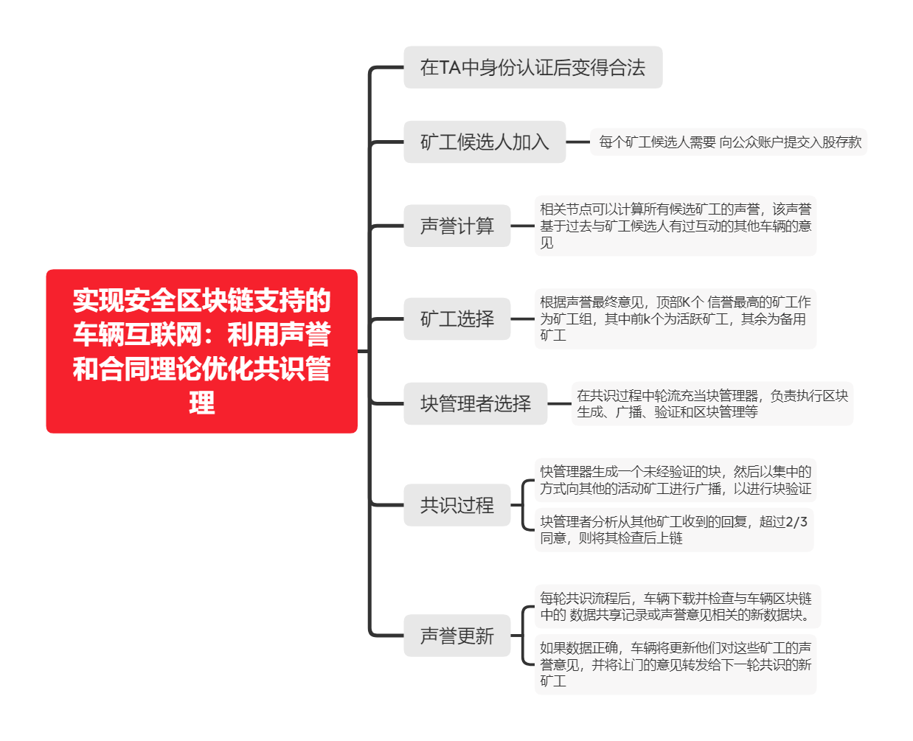
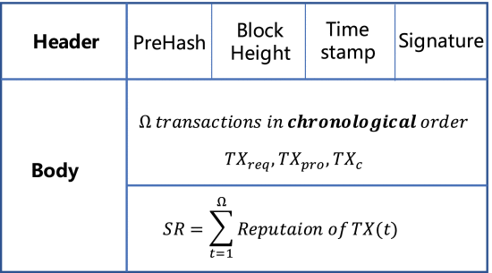
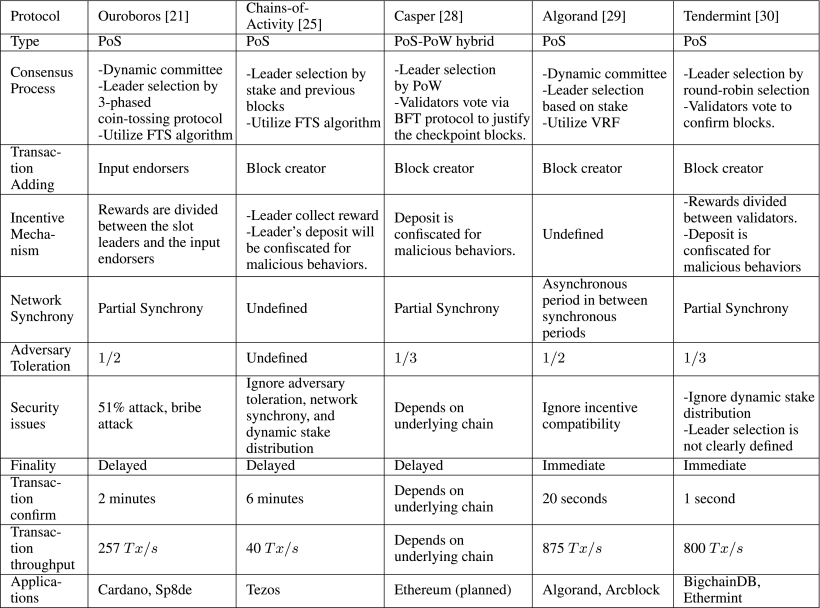

<!--more-->

车联网区块链中的共识算法：

1. 节点数量多、流动性大，节点加入/退出网络频繁。节点不固定（类pbft算法较难适用）
2. 延迟要求较高
3. 车辆节点计算能力有限（Pow不适用）

## 一. 信誉分机制相关

### 实现安全区块链支持的车辆互联网：利用声誉和合同理论优化共识管理

>Toward Secure Blockchain-Enabled Internet of Vehicles: Optimizing Consensus Management Using Reputation and Contract Theory 

https://ieeexplore.ieee.org/abstract/document/8624307/

DPoS共识机制中的安全问题——矿工候选人之间的潜在串通，以及通过基于股份的投票选择矿工候选人时攻击高股份车辆

所提出的安全增强机制在防御内部合谋、对受损候选车辆的高检测率以及与现有方案相比具有更好信誉的方案等方面建立了自己的优势，并优化了所有参与者的效用

### 基于信誉的联盟区块链，用于车辆互联网中的信任资源共享

> Proof-of-Reputation Based-Consortium Blockchain for Trust Resource Sharing in Internet of Vehicles

https://ieeexplore.ieee.org/abstract/document/8918338

**声誉证明（PoR）共识分析**

1. BNs负责收集交易事务，由车辆签名，防止恶意BN伪造

2. 生成块的时间是在每个时隙的末尾，每个交易对应某个车辆的信誉值，每个区块有多个交易组成的信誉（SR）。BNs总是收集那些信誉价值较高的交易，与其他BNs竞争，以发布新的区块。BN一个块中的事务必须遵循时间按顺序（通过时间戳实现）。

   

3. 收到新块后，BNs将停止收集事务并检查接收的块的 SR 值，以检查该块是否具有最高的 SR。同时，还可以检查计算结果和签名的完整性。验证过程后，具有最高 SR 值的块将添加到区块链分类帐中

## 二. POS相关

### 未来区块链网络股权证明共识机制：基础、应用和机遇

> Proof-of-Stake Consensus Mechanisms for Future Blockchain Networks: Fundamentals, Applications and Opportunities 

https://ieeexplore.ieee.org/abstract/document/8746079

**基于股权证明的机制**

[Ouroboros](https://link.springer.com/chapter/10.1007/978-3-319-63688-7_12)

- 动态委员会
- 三阶段的硬币翻转游戏
- FTS算法（依据随机数种子依股权概率选择leader）

[Chains-of-Acticity](https://link.springer.com/chapter/10.1007/978-3-662-53357-4_10)

- 与Ouroboros类似，FTS算法的种子不同于Ouroboros算法。

[tendermint](https://tendermint.com/static/docs/tendermint.pdf)

\

### Casper

[Casper](https://arxiv.org/pdf/1710.09437.pdf) [Casper-CN](https://zhuanlan.zhihu.com/p/40100624)

Pos类型

- 基于链的Pos，通过随机数来决定出块者来模拟挖矿
- 基于拜占庭容错（BFT）

Casper状态固化工具是架设在出块机制之上的。Casper能够保护两个冲突的检查点都不能固化下来，但是攻击者可以组织Casper再固化任何将来的检查点。

**特点**

问责制、动态验证者、防卫、模块化叠加

**Casper协议**

假设有一个固定的验证者集合和出块机制，Casper 要做的工作就从每个父块中只选择一个子块，也就是从区块树中选择一条最权威的链出来。

出于效率考虑，Casper 只考虑由检查点形成的子树，而不是处理整个区块树。创世块是一个检查点，**在区块树中高度是一百的整数倍的块也是一个检查点**

每个验证节点都有抵押；当一个验证节点加入网络，它的抵押就是抵押的 token 的个数。我们说 2/3 的验证者，指的是总抵押规模的 2/3 。

验证者可以广播一条包含四个信息的投票消息：<v, s, t, h(s), h(t)> ：

- s：任何合理检查点的哈希值
- t：s的某一个后代检查点的hash值
- h(s)：检查点s在检查点树中的高度
- h(t)：检查点t在检查点树中的高度
- S：使用验证节点v的私钥对 <v, t, h(s), h(t)> 的签名
- 一个绝对多数的联结是一个有顺序的检查点对 (a，b) ，也就是 a -> b，当有2/3的验证节点（总抵押的 2/3 ）对源a和目标b进行了投票。绝对多数联结是可以跳过检查点，也就是说h(b)>h(a)+1。 图1c有三个用红色标记的绝对多数联结，分别是 r ->b1, b1 -> b2和b2 -> b3
- 两个检查点 a 和 b 在有且只有在如下情况下才认为是冲突的：他们在不同的分支上，也就是 a 不是 b 的祖先或后代，两者没有任何的代属关系。
- 一个检查点 c 在如下情况下被认为是合理的：(1) 它是根节点；(2) 当存在一个绝对多数联结 c' -> c ，且c'是合理的。图1c显示了有四个合理区块的链
- 一个检查点c被称为固化，要满足两个条件：(1) c是合理的；(2)有一个绝对多数联结 c -> c' ，且 c' 是 c 的直接孩子节点。

一个个体验证者 ν 不能发布两个独立的投票：<ν, s1, t1, h(s1), h(t1)> 和 <ν, s2, t2, h(s2), h(t2)>

这两个投票

1. h(t1) = h(t2) 一个验证者必须不能发布两个有相同高度的投票
2. h(s1) < h(s2) < h(t2) < h(t1) 一个验证者不能有一个夹在其他投票中间的投票

两个 Casper 戒律。任何验证者违反任何一条都将失去他们的抵押。

Casper 最显著的一个属性是：**如果没有三分之一以上的验证节点违反前面两个 Casper 戒律，两个相互冲突的检查点是不可能被固化**。

**定理1（可问责的安全性）， 两个冲突的检查点am 和 bn 不能都被固化**。

**定理2 合理的生存能力，假设在固化的链继续生长情况下，绝对多数联结总是被加入用来产生新的固化检查点。**

**动态验证者集合**

每个检查点C都有其对应的朝代数（Dy[nas](http://www.elecfans.com/tags/nas/)ty），其定义为：从根检查点开始至C为止的已敲定检查点数量，例如上图中，b3的朝代数为3。每一代检查点都对应两种验证节点集合：前端（Front）验证节点集合（包含于此代加入的节点）以及后端（Rear）验证节点集合（包含于此代退出的节点）。理论上每代检查点的前端/后端集合会高度重复，但难保节点共谋造成前端/后端集合的大幅变化，若此情形发生，则出错时可能会砍不到坏节点的押金（因为坏节点已退出）导致安全性受到威胁。例如上图中，验证节点A可以退出，代表对C‘分岔（绿色）来说A退出了，可是对C分岔（紫色）来说， A却从来没退出过。因此A有办法继续投旧链C，但新链C’砍不到A的押金（因为已退出）。

为了让每代检查点在出错时都能确实归责，因此需要缝合机制（Stitching Mechanism）将检查点的前端/后端集合「缝」起来，确保每个错误都必定能归责（出错的可能是前端集合或者后端集合）。

综合以上，Casper FFG 几乎针对PBFT 的所有面向都做出改进：

· 经济上的制约：PBFT是许可制的，它仰赖原本就存在信任基础的组织共同运行协定；Casper FFG则是非许可制的，它引入最少砍押金条件，利用经济损失的风险来制约节点的行为，节点之间不需要任何信任基础也能共同运行协定，实现真正的去中心化。

· 抽象的出块机制：PBFT仰赖诚实的主导节点产生区块并需要视域变换机制节制拜占庭节点；Casper FFG不需理会底层的出块机制，只需负责形成共识。出块抽象的好处是：底层网路的出块频率不必与覆盖层的共识频率一致，如此可以增加效率并降低网路的负担。例如：每100个底层区块只产生1个检查点。

· 流水线化的投票：PBFT具有《Prepare》、《Commit》、《View-change》等数种投票讯息；Casper FFG仅有《Vote》一种，且投票的内容并不是单一的区块/请求，而是两个形成连结的检查点，这使Casper FFG能够在不牺牲太多表达力的前提下变得简洁许多。这些形成链式结构的检查点，会于两个不同高度分别经历两轮投票，由于每一轮投票都会敲定源头与证成目标，因此共识能如流水线（[Pi](http://www.elecfans.com/tags/pi/)peline）般不断推进。相似的设计理念也出现于Hot-Stuff，有趣的是，该论文作者Dahlia Malkhi还撰文比较Hot-Stuff与Casper FFG，其相似程度可见一斑。

· 强健的抗攻击性：PBFT不具备对远程攻击（Long-range Attack）以及灾难性崩溃（Catastrophic Crash）的抗性；Casper FFG则具有特别的机制来防御这两种攻击：针对远程攻击，节点必须定期同步区块及禁止回朔（Revert）已敲定的区块；针对灾难性崩溃，Casper FFG则引入「离线溢金」（Inactivity Leak）机制来应对。关于这两种攻击的说明，笔者将于日后另撰文论述。

## 三. 其他

###  基于区块链的拜占庭共识车联网信息认证算法

> A Blockchain-Based Byzantine Consensus Algorithm for Information Authentication of the Internet of Vehicles

https://ieeexplore.ieee.org/abstract/document/8839031

IoV节点分为车载通信节点（VCN）和路边通信节点（RDN）。VCN 是安装在车辆上的移动节点。VCN 的计算和存储能力较弱。RCN 是安装在路边基站的固定节点。与 VCN 类似，RCN 可以及时与网络中的其他节点共享信息，但具有较强的计算和存储能力。因此，RCN 被选为 IoV 中建立共识的节点

根据时间序列判断这段时间是否有节点进出网络，并设置阈值，只有在阈值内的节点才能进入或退出网络

推拉模式更新：

1. 拉取：节点 A 随机选择其邻居 B 作为通信，并请求被动信息更新。然后，节点 B 将节点 A 缺少的信息传输到节点 A。最后，节点 A 将根据收到的信息更新本地信息。在这种情况下，节点 B 获取新信息。
2. 推拉：在第一阶段，此通信模式与拉取模式相同。在第二阶段，节点 A 会将其缺少的信息传输到节点 B。然后，节点 B 将根据收到的信息更新本地信息。

**基于Gossip协议的信息更新过程：**

共有三种类型的信息：**本地信息 （LI）、更新信息 （UI） 和共识信息 （CI）**。LI 是 IoV 中要商定的信息。UI 是通过 RCN 之间的通信形成的持续更新向量;矢量中的每个元素对应于不同节点的 LI。CI 是占用 UI 一半以上的矢量元素。

每个 RCN 的初始 UI 由相应的 LI 和 n-1 空值组成。每对节点在更新后具有相同的 UI。

此过程将重复，直到所有网络节点具有相同的 UI。然后，可以从上次更新的 UI 派生 CI。

基于 UI，共识生成的成功取决于输出的 UI 的一半以上是否属于同一向量元素。如果已达成共识且 CI 正确，CI 将保存为块以加入区块链;

UIs 在传输后没有更改，因为信息是使用哈希函数加密的，并应用于数字签名技术。故拜占庭节点仅仅能控制自己的本地信息，不能篡改他人的本地信息。在更新过程中只能对自己的那一维信息做出篡改，

**分析**：

1. 算法最多允许一般的拜占庭节点共存
2. 收敛速度优于普通的拜占庭共识算法
3. 扩展性好，进入/退出网络灵活

### SG-PBFT：一种安全高效的车联网区块链PBFT共识算法

> SG-PBFT: a Secure and Highly Efficient Blockchain PBFT Consensus Algorithm for Internet of Vehicles

https://arxiv.org/ftp/arxiv/papers/2101/2101.01306.pdf